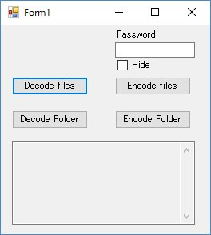

# DecodeCTR
Decode CTR encrypted files of TS viewer for Amazon Cloud Drive on local

## Overview
Encrypt/decrypt application [TS viewer for Amazon Cloud Drive](../../../TSviewACD) encrytion method (without filename encryption)

## Description
Decrypt [TS viewer for Amazon Cloud Drive](../../../TSviewACD) encryted files (without filename encryption) on local. 
You can decode encrypted files downloaded without "TS viewer for Amazon Cloud Drive".

## Requirement
This application is compiled with c# .NET 4.5.2.
Your system doesn't have the Microsoft .NET Framework 4.5.2, please install following link.
<https://www.microsoft.com/ja-JP/download/details.aspx?id=42643>

## How to use
* select files/folder with "decode files" or "decode Folder" button
* Drag&Drop encrypted items to appliction window

output decorded files to the same place of encrypted ones
